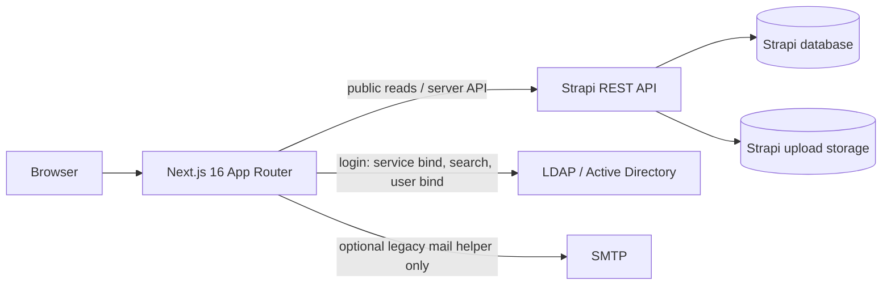

# System Overview

## 1. Purpose

The UKB Telefonbuch is a German-language web directory for finding staff and their contact details. It serves unauthenticated directory lookup and, after Active Directory/LDAP login, self-service maintenance of the caller's own record and delegated management of organization units.

Primary use cases are: search by name, mail identifier, email, telephone number, location, or organization; view a person profile including secretariat, supervisors, organizations, publications and contact data; maintain permitted personal data and photo; and let designated organization managers maintain their unit hierarchy, memberships, functions, secretariat assignments and co-managers.

## 2. Functional Requirements

- Directory results exclude people whose `LDAPActive` is explicitly `false`; reads use Strapi's draft state.
- Search is tokenized, forwarded to Strapi, then ranked in the web application. It supports people, contact data, organization and location.
- A logged-in user may edit only the unique person matching `LDAPUsername`; the legacy fallback is a unique business email match. The LDAP username is the durable identity link.
- Authenticated UI labels show the matching Strapi person's title and name followed by the LDAP username in parentheses; if the Strapi match is unavailable, they fall back to LDAP `displayName` and username.
- User-facing search inputs identify names as the search criterion; they do not present LDAP usernames as an alternative search term.
- The organization membership add/search list stays empty, including pagination, until a name search is entered.
- For persons with `LDAPUsername`, telephone numbers and email addresses are LDAP-owned and must not be changed through self-service. Location and addresses remain editable. ORCID is intentionally not submitted by the current self-service route, despite being modelled and validated.
- Organization managers may act only in their managed organization(s) and descendants. They can assign multiple same-organization secretariat contacts to a person. They cannot delete a unit with children or members, cannot create a root through this UI, and cannot remove an organization's last manager.

## 3. Architecture

Next.js is both the UI and a backend-for-frontend: browser code does not receive the Strapi token or LDAP credentials. `lib/people.ts` implements server-side profile reads; `app/api/people/route.ts` supplies search results; `lib/strapi-admin.ts` and `app/api/admin/organization-units/route.ts` form the privileged delegated-administration boundary. Strapi is the system of record for directory, organization, relations and media. LDAP is the source of authentication and is intended to own selected contact data for linked people.

The login route creates an HS256 JWT valid for eight hours in an `httpOnly`, `SameSite=Lax` cookie. Every mutation independently validates this session and the applicable Strapi-based authorization.

## 4. Repository Structure

- `app/` — Next App Router pages, UI and route handlers.
  - `app/api/people/route.ts` — public directory search and response normalization.
  - `app/api/people/[documentId]/self-service-{update,photo}/route.ts` — authorized self-service writes.
  - `app/api/auth/` — LDAP login and logout.
  - `app/api/admin/organization-units/route.ts` — delegated organization mutations.
  - `app/contact/[documentId]/` — profile and edit UI; `app/admin/` — organization-management UI.
- `lib/people.ts` — Strapi person/profile client and normalization.
- `lib/ldap-auth.ts`, `lib/ldap-person.ts` — LDAP bind/login, JWT cookie and self-edit authorization.
- `lib/strapi-admin.ts` — server-only Strapi admin client and descendant-scope resolution.
- `lib/validation.ts`, `lib/contact-labels.ts`, `lib/countries.ts` — shared input constraints and canonical values.
- `tests/validation.test.ts` — unit tests for validation/sanitization.
- `.env.example` — required configuration names only.

## 5. Technology Stack

TypeScript 5, Next.js 16.1.6 (React 19.2.3, App Router), Tailwind CSS 4, Node.js runtime (exact production version **TO VERIFY**), `ldapts` 9.2.0, `jose` 6.2.12, Nodemailer 8.0.2, Vitest 3.2.4, ESLint 9. Strapi is an external REST CMS; its version, database, upload provider and hosting are **UNKNOWN** from this repository.

## 6. Runtime Components

1. Next.js server: renders pages and executes all API route handlers.
2. Strapi: REST API, content persistence and media upload endpoint (`/api/upload`). It must be reachable from the Next.js server.
3. LDAP/Active Directory: reachable by LDAPS; a read-only bind account searches a configured base, then the submitted password is checked by binding as the discovered user.
4. SMTP: only used by `lib/mailer.ts`; no current route imports it because the former email edit-link route was removed. Treat it as unused/legacy until reintroduced deliberately.

## 7. Configuration

Copy `.env.example` to `.env.local` for local work. Keep it and all credentials out of Git.

| Variable | Required by | Meaning |
| --- | --- | --- |
| `STRAPI_URL` | all Strapi access | Base URL; also allowed image host. |
| `STRAPI_TOKEN` | privileged Strapi reads/writes | Server-side bearer token. Required for admin helper and normally for protected Strapi access. |
| `LDAP_URL` | login | LDAPS endpoint; certificate validation must remain enabled in production. |
| `LDAP_SEARCH_BASE`, `LDAP_BIND_DN`, `LDAP_BIND_PASSWORD`, `LDAP_USER_FILTER` | login | Directory lookup configuration. Default filter is `sAMAccountName={{username}}`. |
| `AUTH_SESSION_SECRET` | sessions | At least 32 characters; signing key for eight-hour JWTs. |
| `SMTP_HOST`, `SMTP_PORT`, `SMTP_USER`, `SMTP_PASS`, `SMTP_FROM`, `SMTP_SECURE` | legacy mail helper | SMTP transport configuration; not currently invoked. |

No configuration validation happens at process startup; missing values fail when the affected feature is used. Configure secrets in the deployment secret store, not source files. `next.config.ts` dynamically permits `STRAPI_URL` as a remote image host.

## 8. Data and Persistence

Persistence belongs to Strapi, not this repository. Expected content types/relations include `people`, `organizations`, `organization-leaderships`, `publication-authors`, publications and uploaded files.

Important person fields: `LDAPUsername`, `LDAPActive`, name, `MailIdentifier`, `Location`, `Phone`, `Mail`, `Address`, `EmployeePicture`, `Organizations`, `PrimaryOrganization`, `ManagedOrganizations`, `Secretariats`, supervisors and `OrganizationLeadershipLinks`. Important organization fields: name, short name, `ParentOrganization`, `Managers`, `Members`, `PrimaryMembers`, and leadership links. `documentId` is the identifier used in application routes and Strapi relations; do not substitute numeric IDs without reviewing all calls.

Strapi owns database backups, migrations, media storage, publication state and retention. Their mechanics are **TO VERIFY** in the Strapi/infrastructure repository. Uploaded photos may become orphaned if upload succeeds but the subsequent person update fails; no cleanup exists.

## 9. Interfaces and Integrations

- Strapi REST: `/api/people`, `/api/organizations`, `/api/organization-leaderships`, `/api/publication-authors`, and `/api/upload`; calls use `status=draft` where edits or complete internal data are required.
- LDAP/AD: search using a service account followed by end-user bind. LDAP filter interpolation escapes special filter characters.
- Browser-facing API: `/api/people`, `/api/auth/login`, `/api/auth/logout`, `/api/people/:documentId/self-service-update`, `/self-service-photo`, and `/api/admin/organization-units`. The organization admin endpoint accepts a `secretariatIds` array for replacing a person's multiple secretariat assignments; the handler validates that every selected contact belongs to the same organization.
- SMTP helper is present but not live. No webhooks, queue, search index, SSO/OIDC, or API version contract is defined here.

## 10. Authentication and Authorization

LDAP authentication is password verification, not authorization. After login, `ukb_directory_session` contains a signed identity with username/email/display name. It is `httpOnly`, `SameSite=Lax`; `secure` depends on request/forwarded HTTPS detection. TLS termination must set `X-Forwarded-Proto: https` correctly.

Self-service requires the session identity to match the target person. Prefer `LDAPUsername`; the business-mail fallback is accepted only if it identifies exactly one person. Admin authorization is data-driven: a person whose LDAP username matches an organization `Manager`/`ManagedOrganizations` relationship obtains access to that organization and all descendants. Mutations repeat scope checks server-side and call Strapi with the server token.

## 11. Development Setup

1. Install a supported Node.js version (**TO VERIFY**; use the deployment version if known) and run `npm ci`.
2. Run `cp .env.example .env.local` and obtain safe development values/access for Strapi and LDAP. A functioning Strapi instance is required for useful manual testing.
3. Start with `npm run dev`, then open `http://localhost:3000`.
4. Run `npm run lint`, `npm test`, and `npm run build` before handoff. `npm run start` serves a completed production build.

## 12. Testing

Vitest covers validation and sanitization (`npm test`). ESLint runs through `npm run lint`. There are no repository-local integration, end-to-end, LDAP, Strapi contract, authorization, upload, or deployment tests. Manual tests must cover a normal user, LDAP-linked user, manager with descendants, unauthorized caller, Strapi failure, and a real image upload in a non-production environment.

## 13. Deployment

Build with `npm run build`, run with `npm run start`, and supply all configuration as deployment secrets/environment variables. There is no Dockerfile, Compose file, CI/CD configuration, registry declaration, IaC, migration process, target platform, health check, or rollback procedure in this repository. Those are **UNKNOWN / TO VERIFY** before production deployment. Strapi schema changes must be deployed and backed up under Strapi's own lifecycle before web changes that depend on new fields or relations.

## 14. Operations

Application failures are primarily written with `console.error`; no structured logging, metrics, tracing, alerting, readiness endpoint, rate limiting, backup/restore runbook, or operational dashboards exist here. Basic diagnosis: check Next.js logs, test reachability/authentication to Strapi, then LDAPS reachability/trust and service-account credentials. Login deliberately returns generic authentication errors; server logs contain availability failures.

Restart the Next.js service after environment changes. Backups/restores are Strapi database and upload-storage responsibilities and must be verified outside this repository.

## 15. Critical Paths

- Public search: `app/ui/Directory.tsx` → `/api/people` → Strapi; server-side ranking depends on normalized relations.
- Login/session: `app/login/LoginForm.tsx` → `/api/auth/login` → `lib/ldap-auth.ts`; preserve secure proxy headers and the 32+ character signing secret.
- Self-service: edit page → `requestCanEditPerson` → validation → Strapi draft update. LDAP-owned phone/mail comparison prevents a linked person bypassing central ownership.
- Administration: `/admin` and route handler call `getManagerOrganizationIds`; its parent traversal defines delegated descendant rights. Changes to organization relation names or hierarchy semantics can broaden or break access.

## 16. Architectural Decisions

### Decision: Strapi is the directory system of record

**Decision:** Store people, organization topology, relations, publications and photos in Strapi; Next.js normalizes and presents them.

**Reason:** Content and relationships need CMS maintenance while the web layer stays focused on UX, authorization mediation and search presentation.

**Consequences:** Strapi schema and API contracts are runtime dependencies; draft-state reads are intentional.

**Do not change without reviewing:** Every `populate`, field name, `documentId` relation, Strapi token scope and publication workflow.

### Decision: LDAP identity with application-signed session

**Decision:** Authenticate via service-account lookup plus user bind, then issue a short-lived signed cookie rather than expose LDAP to the browser.

**Reason:** Passwords are not persisted by the app and backend authorization can use a stable LDAP username.

**Consequences:** LDAP availability and trusted LDAPS certificates are login dependencies; sessions do not auto-revoke before expiry.

**Do not change without reviewing:** Cookie/proxy TLS settings, secret rotation implications, LDAP filter escaping, uniqueness of `LDAPUsername`.

### Decision: Delegated management follows the organization tree

**Decision:** Managers of a root organization may manage that root and recursive descendants; they cannot manage ancestors/siblings.

**Reason:** This maps responsibility scopes to the existing hierarchy and avoids a central admin role in the web app.

**Consequences:** Cycles/malformed parent links can affect traversal; access is dynamically derived from Strapi.

**Do not change without reviewing:** `getManagerOrganizationIds`, all mutation checks, last-manager and deletion safeguards, and Strapi relation semantics.

### Decision: LDAP-linked contact data is centrally owned

**Decision:** Self-service blocks phone/mail changes for any person with `LDAPUsername`.

**Reason:** Avoid overwriting intended LDAP synchronization data.

**Consequences:** The UI may display editable fields that the server rejects if they changed; complete LDAP synchronization is still not implemented.

**Do not change without reviewing:** Field ownership rules and a future import/sync design.

## 17. Known Risks and Technical Debt

- LDAP sync is explicitly only data-model preparation; no importer, attribute mapping or conflict/field-ownership process exists.
- `lib/mailer.ts` and SMTP variables are unused after removal of the edit-link endpoint.
- No startup configuration validation, request rate limiting/CSRF-specific defense, upload size/content inspection, malware scanning, or cleanup of failed/orphaned uploads is present.
- The photo route accepts any MIME type beginning `image/`; trust boundary needs review if Strapi exposes uploads publicly.
- Tests cover only validation. Core authorization, recursive scope, Strapi response-shape compatibility and UI paths lack automated tests.
- Operational/CI/deployment/backup facts are absent from the repository.
- The worktree already contains substantial uncommitted application changes; this document records that current state rather than asserting it has been deployed.

## 18. Maintenance Rules

- Keep the Strapi bearer token, LDAP bind password, session secret and SMTP credentials server-only and out of logs/docs/Git.
- Preserve `documentId` usage and draft-state behavior unless Strapi publication semantics are redesigned end to end.
- Treat `LDAPUsername` as the preferred identity join and require uniqueness for any user-facing permission.
- Any new organization mutation must derive and enforce scope server-side; UI visibility is not authorization.
- Update `next.config.ts` when changing external media hosts.
- Do not enable insecure LDAP certificate handling in production.

## 19. Open Questions

- Which Strapi version, database, upload provider, schema migrations, token scopes and backup/restore procedures are in production? **UNKNOWN**.
- Which Node.js version and deployment topology/proxy headers are supported? **TO VERIFY**.
- Are self-service edits expected to be published immediately, or is draft state intentionally internal-only? **TO VERIFY**.
- Should ORCID be editable? The field is present and validation supports it, but the edit UI/API deliberately omit it. **TO VERIFY**.
- Should SMTP/edit-link functionality be deleted or restored under the LDAP session model? **TO VERIFY**.
- Are organization parent links prevented from forming cycles at the Strapi schema level? **TO VERIFY**.

## 20. Change Log

`2026-10-08 – Added project system documentation for the current Next.js/Strapi/LDAP architecture and its operating constraints.`

`2026-10-08 – Organization managers can now assign multiple same-organization secretariat contacts to a person through the admin UI.`
